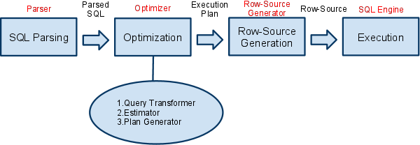
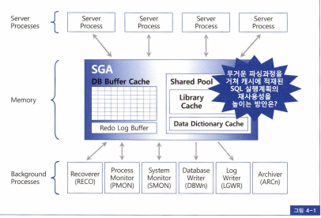

# SQL 파싱

---

**리마인드**

- 라이브러리 캐시 : 내부 프로시저를 반복 재사용할 수 있도록 캐싱해 두는 메모리 공간
- SGA(System Global Area) : 서버 프로세스와 백그라운드 프로세스가 공통으로 액세스하는 데이터와 제어 구조를 캐싱하는 메모리 공간

# SQL 처리 과정

크게 보면 4가지 단계이다.

1. SQL 파싱
2. 메모리(라이브러리 캐시)에 캐싱 여부 확인
    1. 캐싱되어 있으면 바로 실행 ⇒ 소프트 파싱
3. 최적화 단계 수행(Optimizer)
4. Row-Source Generator

       
        🔥 리마인드
        
        ## 소프트 파싱
        
        SQL을 캐시에서 찾아 곧바로 실행단계로 넘어감
        
        > 실행 계획 상에서
        Misses in library cache during parse : 1 (캐시에서 찾지 못한 횟수 1회)
        > 
        
        ## 하드파싱
        
        캐시에서 찾지 못해 `최적화` 및 `로우 소스 생성` 단계가지 모두 거치는 것
        
        하드 파싱은 CPU를 많이 소비하는 몇 안되는 작업 중 하나

4가지 단계를 상세하게 보면

## (1) SQL 파싱

- 처리 수행 : SQL 파서
1. 문장 구성 요소를 분석하고 파싱해 `파싱 트리` 만듦
    1. Syntax 체크(누락된 키워드 체크)
2. Semantic 체크 (의미상 오류 체크, 권한 등)
3. SQL 커서가 `Shared Pool`(라이브버리 캐시) 에 캐싱돼 있는지 확인 → 이 때 **라이브러리 래치 획득**
    1. 찾기 위해 SQL ASCII → 해시값 변환, 해싱 알고리즘으로 찾음
    2. 이때, 해시값이 동일한 SQL문을 찾더라도, 사용자나 옵티마이저 파라미터가 다르면 다른 쿼리로 취급
4. 만약 캐싱된 값을 못찾으면, **shared pool 래치 획득** 적절한 프리 청크를 찾아 아래 과정 수행
    1. SQL을 저장하기 위한 공간을 확보

        🔥 **library 래치 경합** : 소프트파싱, 하드파싱 모두 발생
        **shared pool 래치 경합** : 하드파싱에서 발생
        

        > 라이브러리 래치 : 라이브러리 캐시 영역에 대한 탐색 동기화
        라이브러리 캐시 락.핀 : 핸들과 LCO를 보호하는 역할
          * 소프트 파싱때 래치 경합은 발생하나 락 경합은 발생하지 않음, 락은 shared모드로 접근한다
          * DML문은 shared모드로 획득하여 경합X
          * DDL문은 exclusive 모드로 획득하여 경합O
        > 

## (2) SQL 최적화

옵티마이저는 시스템 통계 및 오브젝트 **통계 정보로 효율적인 실행 계획 선택**

옵티마이저가 최적화 수행 시 아래 3개의 서브 엔진 사용

- Query Transformer : 사용자가 던진 SQL을 최적화하기 쉬운 형태로 변환
- Plan Generator : 후보 군이 될만한 실행 계획 생성
- Estimator : 실행 계획의 총 비용을 계산(예상치)

## (3) Row-Source Generation

앞서 만들어진 실행계획을 실제 **실행 가능한 코드** 또는 프로시저 형태로 포맷팅하는 작업

## (4) SQL 실행

SQL 커서에 대해 **`library cache lock/pin`**을 shared 모드로 획득하고 SQL문장 실행

단, DDL문장의 경우 해당 객체에 해당하는 LCO에 대해 library cache lock/pin을 exclusive모드로 획득하기도 한다

## (5) 실행이 완료된 SQL커서 데이터 패치

위에서 잡은 library cache lock은 null 모드로 pin은 해제한다.

*(참고 : [https://dataonair.or.kr/db-tech-reference/d-lounge/technical-data/?mod=document&uid=234780](https://dataonair.or.kr/db-tech-reference/d-lounge/technical-data/?mod=document&uid=234780))*

### 하드 파싱

위 (2)~(3) 은 하드파싱에서 이뤄지며

- 하드 파싱 과정에서 **Shared Pool과 라이브러리 캐시**에 대해 발생하는 **래치 경합**도 CPU를 많이 소비
    - Shared Pool 래치가 필요한 이유 : 새로운 SQL 정보를 담을 청크를 할당받기 위해 프리리스트를 탐색해야 함
- 데이터 딕셔너리 조회를 수반함

## 참고

### Shared Pool

- SGA 영역 내 존재
- 파싱 작업을 위해 사용
    - Library Cache : SQL 공유 커서(+프로시저, 함수, 패키지, 트리거, PL/SQL) 및 데이터베이스 오브젝트에 대한 정보 관리
    - Reserved Pool : Parsing 크기가 큰 데이터를 저장
    - Data Dictionary Cache : Parsing 에 필요한 정보 저장
    - Server Result Cache : Parsing없이 결과를 확인할 수 있도록 쿼리의 결과값만 저장하는 메모리
    

### Shared Pool 래치

- Shared Pool의 기본 메모리 구조인 힙을 보호하는 역할
- 프리 청크를 찾기 위해 프리 리스트를 탐색하고, 적절한 청크를 할당하고, 필요한 경우 프리 청크를 분할하는 일련의 작업은 모두 Shared Pool 래치를 획득 후에만 가능
- 기본적으로 전체 인스턴스에 하나만 존재
    - 힙 구조이기 때문에(?)
    - 9i부터는 sub pool로 나누어 관리할 수 있개 되면서 래치도 7개까지 사용 가능(7은 작은 숫자임을 명시→ 하드 파싱에 부하가 크다는 것을 의미하기도 함)

*(참고 : [https://dataonair.or.kr/db-tech-reference/d-lounge/technical-data/?mod=document&uid=234793](https://dataonair.or.kr/db-tech-reference/d-lounge/technical-data/?mod=document&uid=234793))*
