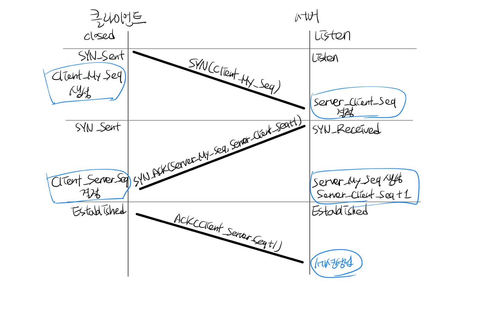

## 악성 소프트웨어(Malware)
컴퓨터, 서버, 클라이언트, 컴퓨터 네트워크에 악영향을 끼칠 수 있는 모든 소프트웨어의 총치이다.

### 종류
- 컴퓨터 바이러스 : 프로그램을 통해 감염되는 악성 소프트웨어
	- 스스로 전파할 수없다.
	- 다른 실행 프로그램에 기생하여 실행된다.
	- 보통 컴퓨터 파일을 감염시키거나 손상시키며, 네트워크에 영향을 주지 않고 컴퓨터에 대해서만 활동한다.
- 웜 : 컴퓨터의 취약점을 찾아 네트워크를 통해 스스로 감염되는 악성 소프트웨어
	- 웜은 독자적으로 실행되며 다른 실행 프로그램이 필요하지 않다
	- 웜은 종종 컴퓨터의 파일 전송 기능을 착취하도록 설계한다.
	- 바이러스와 다르게 스스로 전달할 수 있다 => 네트워크를 사용하여 자신의 복사본을 전송시킬 수 있다,
	- 일반적으로 네트워크를 손상시키고 대역폭을 잠식한다.
- 웜 바이러스 : 웜과 바이러스의 감염방법을 동시에 갖춘 악성 소프트웨어
- 트로이 목마 : 자가 복제능력이 없는 악성 소프트웨어
	- 악성 루틴이 숨어있는 프로그램, 겉보기에는 정상적인 프로그램이지만 실행 시 악성코드를 실행한다
	- 많은 트로이 목마들은 백도어로서 사용된다
	- 보통 다른 파일에 삽입되거나 스스로 전파되지 않는다
	- 목적 : 파괴적 목적, 자원이나 신분의 사용(DDos악용), 금전 절도, 랜섬웨어, 데이터절도, 스토킹
- 스파이웨어 : 사용자의 정보를 빼내는 악성 소프트웨어
	- 사용자의 동의 없이 설치되어 컴퓨터의 정보를 수집하고 전송하는 악성 소프트웨어
- 애드웨어 : 컴퓨터 사용시 자동적으로 광고가 표시되게 하는 악성 소프트웨어
	- 프리웨어인 경우 불가피하게 광고 수익으로 운영되는 경우가 있기 때문에, 애드웨어라고 반드시 악성소프트웨어는 아니다
	- 문제가 되는 이유는) 스파이웨어와 비슷하게, 사용자에게 동의나 통보없이 사용자의 활동을 기록하고 보고한 다음에 때로는 재판매하기 때문이다
- Hoax : 악성코드에 대한 잘못된 정보로 악영향을 끼치는 소문
- 하이재커 : 의도치 않은 사이트로 이동을 시키고 팝업창을 띄우는 악성 소프트웨어
	- 스파이웨어와 애드웨어와 비슷한 맥락
- 랜섬웨어 : 특정 파일을 암호화하여 파일을 사용 불가능 상태로 만들어서 복구를 위해 돈을 요구하는 악성 소프트웨어


## 보안장비에 대한 정리
1. Firewall
2. IPS
3. WAF


## Zero-day attack, One-day attack
- zero-day attack : 취약점이 발견되기 전, 혹은 당일에 발생하는 공격
- one-day attack : 취약점이 발견되고 패치가 나왔으나 아직 적용되기 전에 발생하는 공격


## OWASP(가장 빈도 높은 공격방식) Top10
1. 인젝션
2. 취약점 인증
3. 민감한 데이터 노출
4. XML 외부 개체(XXE)
5. 취약한 접근 통제
6. 잘못된 보안 구상
7. 크로스사이트 스크립팅(XSS)
8. 안전하지 않은 역직렬화
9. 알려진 취약점이 있는 구성요소 사용
10.불충분한 로깅 및 모니터링

## OSI7layer 정리

## Session 맺는 과정 - 3handshaking

### fin, reset 패킷의 사용 이유

## Well-known 포트 정리

## 통신 패킷 구조 정리

## DPI(Deep Packet Inspection) 

## DNS 동작원리
> DNS서버를 직접 입력하거나 DHCP를 통해 자동으로 할당받아 설정 가능
- Linux : /etc/resolv.conf 파일에 DNS 입력 가능
- Windows : [제어판]-[네트워크 및 공유센터]-[어댑터 설정 변경] -> 인터넷 프로토콜(TCP/IP) 속성
	-	현재 이용중인 DNZ서버 확인 : ipconfig /all
	-	캐시된 DNS 정보 : ipconfig /displaydns
	-	캐시된 DNS 정보 삭제 : ipconfig /flushdns

### 클라이언트가 DNS 서버로부터 도메인의 IP를 얻는 순서
로컬 DNS 질의 -> 루트 DNS 질의 -> com DNS 서버 질의 -> 최종 wishfree DNS서버 질의
아래는 최악의 경우
1. hosts 파일에 정보가 없으면 시스템에 설정된 DNS서버인 로컬 DNS서버에 질의
2. 로컬 DNS 서버에도 해당 정보가 없으면 루트DNS 서버에 질의
3. 루트 DNS 서버에 www.wishfree.com에 대한 정보가 없으면 com을 관리하는 DNS서버에 대한 정보를 보내준다
4. 로컬 DNS 서버는 com DNS 서버에 www.wishfree.com 에 대해 다시 질의한다
5. 해당 정보가 없을 경우, com DNS 서버는 다시 wishfree.com에 질의하도록 로컬 DNS 서버에 보낸다.
6. 로컬 DNS서버는 마지막으로 wishfree.com의 DNS 서버에 질의
7. wishfree.com의 DNS서버로부터 www.wishfree.com에 대한 IP주소를 얻는다
8. 해당 IP주소를 클라이언트에 전달한다

## 방화벽 탐지
> 서버에 방화벽이 있는지 확인하는 방법
>  리눅스 : traceroute, 윈도우 : tracert

```
C:\Users\>tracert 27.115.156.183

최대 30홉 이상의 27.115.156.183(으)로 가는 경로 추적

  1    <1 ms    <1 ms    <1 ms  192.168.219.1  -> 게이트웨이
  2     3 ms     3 ms     3 ms  106.241.186.129
  3     3 ms     2 ms     2 ms  10.18.162.121
  4     3 ms     3 ms     3 ms  10.18.162.113
  5     2 ms     1 ms     2 ms  1.208.100.73
  6     2 ms     2 ms     2 ms  1.213.141.9
  7     2 ms     2 ms     3 ms  1.213.107.85
  8     3 ms     2 ms     2 ms  1.213.152.30
  9    23 ms    21 ms    25 ms  211.44.125.169
 10    10 ms    11 ms     4 ms  175.126.127.73
 11     4 ms     4 ms     4 ms  10.222.19.132
 12     4 ms     4 ms     4 ms  100.127.35.3
 13     4 ms     3 ms     4 ms  100.127.35.133
 14     *        *        *     요청 시간이 만료되었습니다. -> 방화벽
 15     5 ms     6 ms     5 ms  27.115.156.183

추적을 완료했습니다.

```
> "* * *" 만 표시되는 곳은 라우터에서 필터링 해주고 있거나 방화벽이 존재한다고 생각하면됨
> 만약 바로 결과가 나온다면 구간에 방화벽이 없음을 의미

### 스니핑, 스푸핑
> 스니핑 : 대화를 엿듣는 일, 도청! ex.TCP Dump도 스니핑의 일종
> 스푸핑 : 정보를 얻어내기 위해 중간 단계를 변조? 속이는 것


## 터널링(Tunneling) / VPN
> 인터넷을 사적이고 안전한 네트워크의 일부로 사용하게 하는 기술
> 즉, 두 네트워크를 한 네트워크처럼 안전하게 만드는 기술

#### 원리
OSI 7계층에서는 패킷을 캡슐화한다(4->3계층, 3->2계층으로 통과하기위해)
그리고 라우터나 스위치 같은 네트워크 장비를 지나갈때 디캡슐화하는데, 
터널링장비를 통하면 캡슐화 단위가 다르다.
1. [[데이터]-4계층-3계층-2계층] 데이터 전송
2. [터널링장비 A] (네트워크 장비 대신) 캡슐화
3. [터널링장비 B] 디캡슐화하여 다음 네트우커르 전달
// 네트워크 해킹과 보안 p285 참고

* 터널링 장비를 통할때 디캡슐화하지 않고, 캡슐화 수행
 
#### SSH 터널링
vpn보다 훨씬 간단
> 내부 관리자가 외부 서비스를 안전하게 이용하기 위해, 혹은 내부인이 방화벽을 우회하여 막힌 외부 서비스를 이용할 때 사용

 ### 터널링의 대표적인 장비 : VPN(virtual Private Network)
 > 외부 인터넷 회선을 회사 내부 임대 회선처럼 사용할 수 있게 해주는 솔루션
 > (임대회선은 매우 비쌈, 재택근무때문에 지역마다 임대회선을 설치해줄 수 없으나, VPN솔루션은 비교적 매우 저렴함)
 * VPN이 임대회선과 비슷한 수준의 기밀성 제공을 위해선 암호화 필요
	 * 사용하는 암호화 프로토콜 : PPTP, L2TF, IPSec, SSL 등


## TCP 세션 하이재킹(Session Hijacking) : 세션 가로채기
> 세션 : 사용자와 컴퓨터, 또는 두 컴퓨터 간의 활성화 상태
> 원리 : 서버와 클라이언트가 통신할 때 TCP의 시퀀스 넘버를 제어하는데 문제가 있는 것을 악용
* TCP세션 하이재킹을 IP 스푸핑으로 부르기도 한다
* TCP 세션 하이재킹의 종류
	* Non-Blind Attack(로컬 세션 하이재킹 공격)
		* 공격 대상을 알아내, 시퀀스 넘버를 알고 공격
	* Blind Attack(원격 세션 하이재킹 공격)
		* 시퀀스 넘버를 찍음 -> 시퀀스 넘버는 32bit로 (40억의 경우의 수..) 확률 매우 낮음

* 탈취시 할 수 있는 것
	* 클라이언트와 서버간의 통신 염탐
	* 트러스트를 이용한 텔넷, FTP 등 TCP를 이용한 거의 모든 세션 갈취
	* OTP, 토큰 기반 인증을 이용한 세션 갈취도 가능

#### TCP 시퀀스 넘버 교환
| 명칭| 설명 |
|--|--|
|Client_My_Seq| 클라이언트가 관리하고 있는 자신의 시퀀스 넘버|
|Client_Server_Seq|클라이언트가 관리하고 있는 서버의 시퀀스 넘버|
|Server_My_Seq|서버가 관리하는 자신의 시퀀스 넘버|
|Server_Client_Seq|서버가 알고 있는 클라이언트의 시퀀스 넘버|
|Data_Len|데이터의 길이|


<!--stackedit_data:
eyJoaXN0b3J5IjpbMTg3Nzg0NDY0OCwxNTQ2MTczMjkzLC0xOD
kwNzAyODEzLC0yMDM0MTYzNDA4LC0xODA1NDU5MTcyLC02OTYw
MzE5NzQsMTY5MzM2NzM3NV19
-->